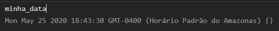

# Clock

Parece apenas um relógio? É muito mais do que isso.

# Início

---

Esse projeto é um ponto de partida pra entender como manipular a página com JavaScript. Basicamente é um relógio e os relógios são simples. Mas como lidar com algo que atualiza constantemente? 

Pra responder essa pergunta vamos precisar trabalhar em alguns itens.

- Capturar o horário do navegador
- Criar um "loop" infinito no script
- Exibir a informação na tela.

 **MÃO NA MASSA...**

# Capturar o horário do navegador

---

Por sorte, isso é uma função nativa do JavaScript. Ela possui diversas opções e cada uma delas nos retorna os dados de uma forma diferente. Para usarmos essa função precisamos armazenar a data numa variável. Por exemplo:

```jsx
let minha_data = new Date();
```

Tente executar isso no [console do navegador](https://developers.google.com/web/tools/chrome-devtools/console?hl=pt-br#abrir_como_um_painel) e depois escreva o nome da variável, você vai receber uma informação bem completa do momento em que a variável foi criada.



Agora vamos usar as funções do JavaScript para acessar nossos dados de forma individual, nós queremos apenas a hora, os minutos e os segundos no relógio.

```jsx
	var d = new Date(); //cria nossa variavel de data
  var h = addZero(d.getHours()); //pegamos a hora
  var m = addZero(d.getMinutes()); //e os minutos
	var s = addZero(d.getSeconds()); // e os segundos
```

Notou algo estranho? existe um addZero antes dos métodos que pegam nossos valores. Isso acontece pois o quando pedimos a hora, ao invés de 09 por exemplo teremos apenas 9. Pra ficar mais claro 09:05 seria retornado como 9:5 e isso fica bem estranho. Por isso temos a seguinte função:

```jsx
function addZero(i) {
  if (i < 10) { //se nosso valor for menor do que 10
    i = "0" + i; //adicionamos um 0 antes.
  }
  return i;
}
```

### Vamos organizar isso em funções...

```jsx
function addZero(i) { // uma função para adicionar o 0
  if (i < 10) {
    i = "0" + i;
  }
  return i;
}

function relogio() { // a função do relógio
  var d = new Date();
  var h = addZero(d.getHours());
  var m = addZero(d.getMinutes());
  var s = addZero(d.getSeconds());
}
```

# Criar um "loop" infinito no script

Essa é a parte mais fácil, o JavaScript oferece uma forma de executar uma função repetidamente com um intervalo de tempo pre-definido. O nome dessa função é **setInterval.** Tudo que temos a fazer agora é chamar esse método e colocar nossa função nele.

```jsx
setInterval(relogio, 1000);

// Isso vai fazer nosso relógio ser atualizado a cada 1000 milésimos de segundo, ou seja
// a cada 1 segundo, que é o tempo que um relógio demora para atualizar.

```

# Exibir a informação na tela.

Crie um arquivo .html, precisaremos de um lugar para inserir os dados do relógio.

```jsx
<p id="timer"></p> // Sim, é só isso mesmo.
```

Nosso script agora vai precisar enviar as informações para o html, eu gosto de usar [jquery](https://www.w3schools.com/jquery/) pois a leitura do código fica melhor (mas isso é gosto pessoal). Enfim, nosso script ganha mais uma linha.

```jsx
function relogio() { // a função do relógio
  var d = new Date();
  var h = addZero(d.getHours());
  var m = addZero(d.getMinutes());
  var s = addZero(d.getSeconds());
	// é aqui que a mágica acontece.
	$('#timer').text(h + ":" + m + ":" + s);
}
```

# Finalizando.

Parecia apenas um relógio no inicio mas quando se trata de programação, projetos simples podem nos ensinar muitas coisas novas. O resto do projeto é questão de estilização, você devia dar uma olhada em como implementei o **dark mode** com javascript.

Nosso script completo fica assim:

```jsx
setInterval(relogio, 1000);

function addZero(i) { // uma função para adicionar o 0
  if (i < 10) {
    i = "0" + i;
  }
  return i;
}

function relogio() { // a função do relógio
  var d = new Date();
  var h = addZero(d.getHours());
  var m = addZero(d.getMinutes());
  var s = addZero(d.getSeconds());
	// é aqui que a mágica acontece.
	$('#timer').text(h + ":" + m + ":" + s);
}
```

### E o resultado final é este:  [https://viniciusrodrigues11.github.io/clock/](https://viniciusrodrigues11.github.io/clock/)
